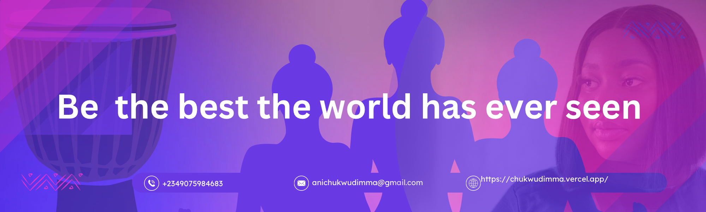
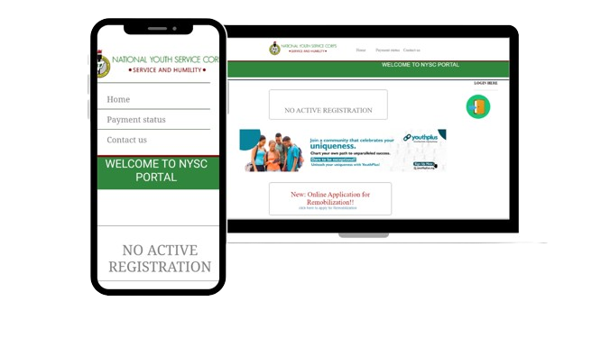

<h1 align="center">Hello I'm  Chukwudimma Ani</h1>

 

## 👨🏻‍💻 About Me:

- 🙋‍♂️ All about me is at **[My Website](https://chukwudimma.vercel.app/)**

- 🔭 I’m currently working on `Something Intresting`.

- 🌱 I’m currently learning `React.js`

- 👯 I’m looking to collaborate for `backend Projects`

- 💬 Ask me about anything, Except Maths & geography :sweat_smile:

- 👨‍💻 Life Hack: Learn new tech :fire: and always have a secret stash of.... snack what did you think i was going to say :tada:

- ⚡ Fun fact: I waste most of my time watching reality tv

## 🛠️ Technologies and Tools I use:

 

 

  

 
 

 

## ❤️ Let's get connected:

    

## Example of works
  

  
  

