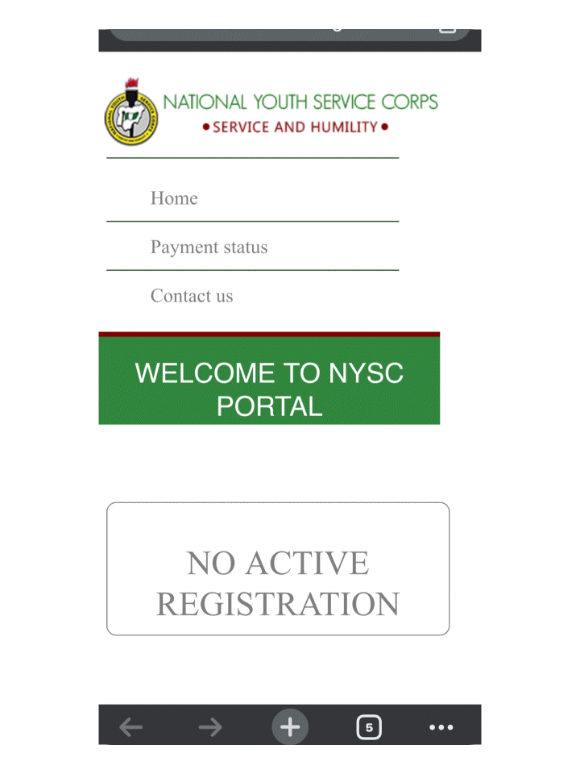

#  Chukwudimma Ani
 I'm a web developer,I really enjoy travelling and learning about people and framework like React as well building API.i'm a full stack Web developer.you can check me out on linkedin

# Skills and Experience
* ✡️ React
* 📱 React Native
* 🖥️ JS / HTML / CSS

 
## Example of works
       

## - 📫 How to reach me: aniChukwudimma@gmail.com 

###       

